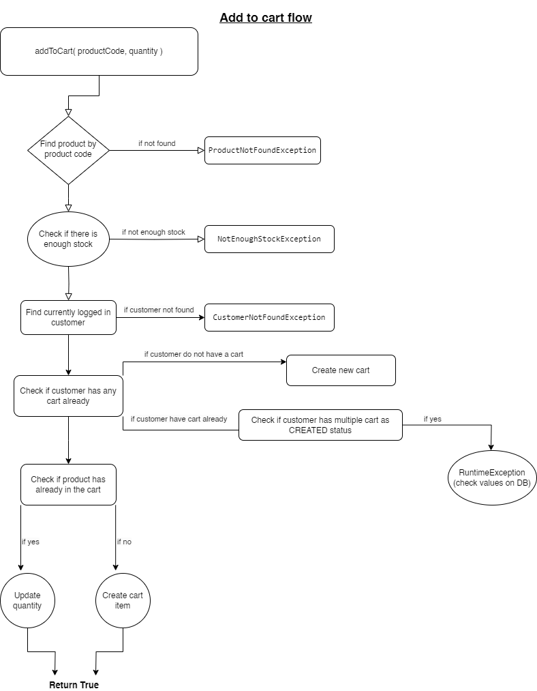
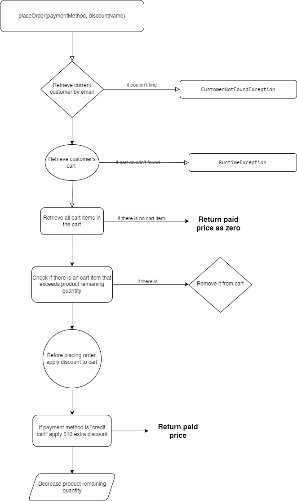

# E-commerce Project

### 📖 Information

<ul style="list-style-type:disc">
  <li>A simple e-commerce application. Customers can browse, add products to their carts, and admins can manage inventory by adding new products and create discounts.</li>
</ul>

### 📖 Technical Information
<ul style="list-style-type:disc">

- **Architecture:**
  - Three-tier architecture with Controller, Service, and Repository.

- **API Design:**
    - Followed RESTful principles for scalable and maintainable APIs.

- **Database:**
    - PostgreSQL used as the database.
    - Interaction with the database done using JPA and Hibernate.

- **Security:**
    - Implemented Spring Security with JWT token.

- **Documentation:**
    - API endpoints documented with OpenAPI3.

- **Logging and Exception Handling:**
    - Efficiently managed logging and exception handling.

- **Aspect-Oriented Programming (AOP):**
    - Applied AOP principles for improved logging, exception handling, and security.

- **Third-Party Integration:**
    - Used Spring Cloud OpenFeign client to consume a third-party currency API.

</ul>

### Technologies

---
- Java 11
- Spring Boot 2.7.16
- Restful API
- Spring Cloud Open Feign
- Spring data, JPA & Hibernate,
- PostgreSQL
- Spring Security & JWT
- Maven
- Junit5
- Mockito
- Unit & Integration Tests
- Docker
- OpenAPI3
- Lombok

---

### Business Logics

- **Unique Customer Emails:** Each user's email must be unique within the system to ensure proper identification and communication.

- **Multiple Addresses per Customer:** Customers have the flexibility to store more than one address in the system, allowing for convenient shipping to various locations.

- **Cart Management:** Customers can maintain multiple shopping carts within the system. However, only one cart can be in the "Created" status at a time, indicating an ongoing shopping session. Once an order is placed, the cart transitions to the "Sold" status.

- **Payment Methods:** Customers have four payment options: Credit card, Transfer, Buy now pay later, and Balance. The "Balance" option allows customers to deposit funds into their account for future use, facilitating easy and efficient payment processing.

- **Discounts:** Special discounts are available to customers based on their payment method. Choosing credit card payment grants a $10 discount, while selecting the balance option offers a $20 discount. Additionally, customers can apply unique discount codes provided by the system, which are categorized as either amount-based or rate-based discounts. These discounts are created by admin users and can be applied during checkout to reduce the total order amount.

- **Currency Conversion:** Customers have the flexibility to view their orders in various currencies. The system automatically converts the order total into the user's preferred currency using live exchange rate data, ensuring accurate and transparent pricing.

By adhering to these business logics, the e-commerce application provides a seamless and personalized shopping experience for customers while maintaining efficient and reliable transaction processing.

### Application Flows

#### Add To Cart Flow

#### Place Order Flow

### Creator

- [Muhammed Ihsan SOLAK](https://github.com/muhammedihsansolak)